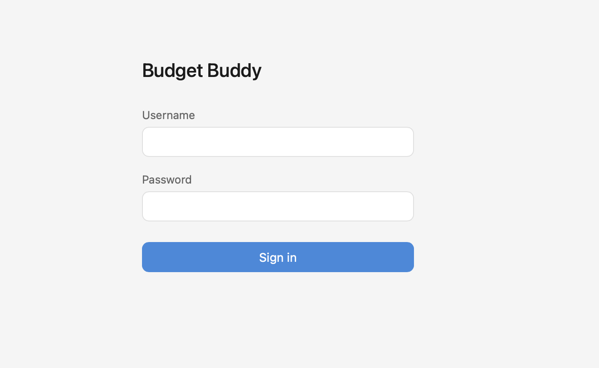
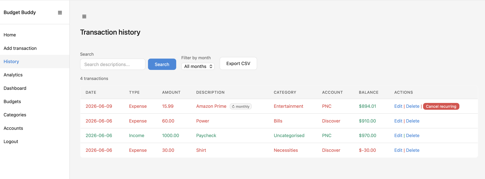
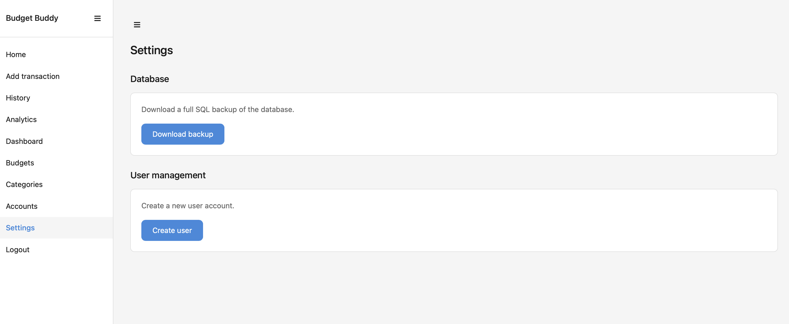

# Budget Buddy

A personal budget tracking and ledger system built with Python, Flask, and PostgreSQL.

## Why I Built This

I decided to build Budget Buddy because I was looking to expand my understanding of SQL, Python, and database systems. My lack of hands-on experience with these tools drove me to want to develop something new. Rather than focusing on courses I decided to build something real, that is where Budget Buddy came along!

## Live Demo

🔗 [budget.seandesmet.com](https://budget.seandesmet.com) *(requires login — personal use only)*

## Screenshots

### Login


### Transaction History


### Analytics


### Dashboard


### Settings


## Features

- **Transaction tracking** — log income and expenses with categories, accounts, and dates
- **Recurring transactions** — set transactions to repeat monthly or weekly, auto-processed on page load
- **Transaction history** — search, filter by month, pagination, and running balance column
- **CSV export** — download filtered transactions as a CSV file
- **Analytics** — savings rate, year over year comparison, spending by day of week, and predictive budget suggestions based on the last 6 months of spending
- **Dashboard** — Chart.js visualisations including spending by category, cash flow, net balance over time, and budget performance
- **Budget management** — set budgets per category and track actual vs budgeted spending
- **Database backup** — download a full pg_dump backup directly from the browser
- **Dark mode** — automatic system-based dark mode support
- **Mobile responsive** — collapsible sidebar, horizontal table scroll, tested on iPhone

## Tech Stack

| Layer | Technology |
|-------|-----------|
| Backend | Python 3, Flask, Gunicorn |
| Database | PostgreSQL 16 |
| Frontend | Jinja2, Chart.js, custom CSS |
| Containerisation | Docker, Docker Compose |
| Reverse proxy | Nginx |
| SSL | Let's Encrypt (Certbot) |
| Hosting | DigitalOcean Droplet |
| Registry | Docker Hub |

## Architecture

```
Mac (development)
    ↓ git push + ./deploy.sh
Docker Hub (caddismaster/budget-buddy:latest)
    ↓ docker-compose pull
DigitalOcean Droplet
    → Nginx (SSL termination, reverse proxy)
        → Gunicorn → Flask app
        → PostgreSQL (Docker volume)
```

- All code developed on Mac, built as a multi-platform Docker image, and deployed to a DigitalOcean Droplet
- Nginx handles HTTPS and routes traffic — Flask is never directly exposed
- Database lives in a Docker volume with automatic schema initialisation on first startup

## Project Structure

```
budget-buddy/
├── app/
│   ├── __init__.py       # Flask app, Flask-Login, rate limiting
│   ├── models.py         # User model for Flask-Login
│   ├── routes.py         # All routes and business logic
│   ├── db.py             # Database connection
│   ├── static/
│   │   └── style.css     # Full stylesheet with dark mode
│   └── templates/        # Jinja2 HTML templates
├── sql/
│   └── schema.sql        # Full database schema
├── landing/
│   └── index.html        # Personal home page (seandesmet.com)
├── screenshots/          # App screenshots for README
├── Dockerfile
├── docker-compose.yml
├── deploy.sh             # Multi-platform build and push to Docker Hub
└── requirements.txt
```

## Local Setup

**Prerequisites:** Docker Desktop

```bash
git clone git@github.com:CaddisMaster/budget-buddy.git
cd budget-buddy
```

Create a `.env` file:
```
DB_HOST=db
DB_PORT=5432
DB_NAME=budget
DB_USER=admin
DB_PASSWORD=yourpassword
SECRET_KEY=yoursecretkey
```

Start the app:
```bash
docker-compose up
```

Open [http://localhost:5001](http://localhost:5001) in your browser.

The database schema initialises automatically on first startup. No manual SQL setup required. Create an admin account via psql after first startup.

## Database Schema

- `transactions` — id, amount, description, category_id, account_id, transaction_date, transaction_type, is_recurring, frequency, next_due
- `categories` — id, name, description
- `budgets` — id, category_id, amount, period_start, period_end
- `account` — account_id, account_name, type
- `users` — id, username, password_hash, is_admin, created_at

## Security

- Flask-Login session-based authentication — no public registration
- Flask-Bcrypt password hashing — passwords never stored as plain text
- Admin-only routes for settings, backup, and user management
- Flask-Limiter — 60 requests per minute per IP
- Gunicorn production WSGI server (no Flask dev server in production)
- Nginx reverse proxy — Flask port never publicly exposed
- ufw firewall — only ports 22 and Nginx Full allowed
- HTTPS via Let's Encrypt with auto-renewal
- debug=False in production

## Roadmap

- [ ] Multi-user data isolation — per-user transactions and budgets
- [ ] CSRF protection via Flask-WTF
- [ ] Empty states and default categories for new users
